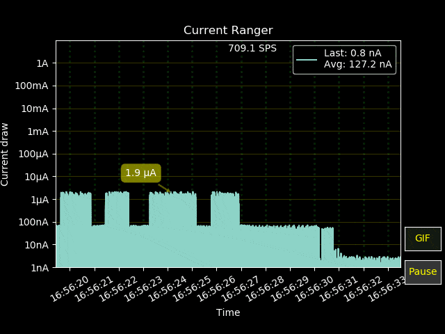

# CurrentViewer

CurrentViewer interactive data plot for [LowPowerLab CurrentRanger](https://github.com/LowPowerLab/CurrentRanger). It was designed to make it easier to capture and share power state profiles for IoT devices that swing between multiple power states (deep sleep, low power, full power).



Example above is CurrentViewer in action (exported from the app itself).

Note: CurrentViewer is not a replacement for an osciloscope, as the readings are done via the internal ADC in SAMD21 which has its limitations. But it might be more convenient way to use CurrentRanger. Sometimes the noise (Vpp) can be comparable with entry level oscilloscopes, but the measurements can be off: CurrentRanger has to be properly calibrated in order for the measurements to match what multimeter or oscilloscope displays.

#
## Features:
- Runs on Windows and Linux (MacOS coming soon)
- It displays:
    - __SPS__ (Samples per Second) - how fast CurrentRanger sends samples over USB
    - __Last__ measurement (noisy) - most recent reading
    - __Average__ of the view (slow). The window buffer is currently set to last 10K measurements - this is easy to extend if needed
    - Point __annotations__ (hover the mouse over a certain sample)
- __Logaritmic plot__: makes it easy to read any swings from 1 nanoamp to 1 amp. Works with CurrentRanger in AUTORANGE as well as manual mode.
- Should be able to display as fast as the instrument can measure and send data over USB-Serial: currently this is around __750-800 samples/second__ without the CR OLED module (and 650 samples/second with OLED on).
- Automatically __turns on streaming on CurrentRanger__ (and if you use the new firmware feature with SMART AutoOff now the instrument will stay on as long as CurrentViewer is connected to it).
- It can save the chart **animations as .GIF** - for a convenient way to publish measurements on the web. Look for *current0.gif, current1.gif, etc* in the current folder
- **[Pause]** streaming if you want to zoom/pan into the data. The data is still being captured behind, when you resume you see an instant refresh.

#
## Installation

First clone the repo locally

```
git clone https://github.com/MGX3D/CurrentViewer
```

Recommended environment is Python3 (tested with 3.6+) with matplotlib/mplcursors/pyserial installed. To install all the requirements automatically:

```
pip install -r requirements.txt
```
or
```
pip3 install -r requirements.txt
```

#
## Running

First you need to identify the COM port CurrentRanger is plugged into (eg COM3 or /dev/ttyACM0). CurrentViewer was only tested with direct USB connection (might work with BlueTooth already - but needs validation). 

On Windows:
```
python current_viewer.py COM9
```

On Linux:
```
python current_viewer.py /dev/ttyACM0
```

If everything is working well you should see an image like this below (otherwise the console and current_viewer.log will have more information). There is also a console window (and a log: current_viewer.log) that displays more info.


#
## Known limitations

- Some runtime errors on MacOS / Python 3.8.5 
- Not tested with the BlueTooth add-on yet
- The chart rendering can be CPU intensive and can affect the streaming speed even though it's done on a separate thread. Currently chart is being refreshed at 10fps (100ms). If you need a higher sampling rate (unlikely) you can relax the framerate by changing the *csp.chartSetup(refresh_interval=100)* (this is milliseconds between frames)
- Cannot always put the device in a predictable USB streaming mode (check the troubleshooting steps below)
- Negative data (or noisy data) - this is what's coming from the device. As the firmware improves (Felix has some ideas) this will improve as well.
- Cannot zoom X axis (time) while the data is streaming - limitation in matplotlib, best to use [pause], zoom in, then resume
- Cannot see microseconds - the data is captured with microsecond timestamps, unfortunately there seems to be a limitation in matplotlib in that it doesn't display it 

#
## Troubleshooting

**Note:** Do not direct support requests to LowPowerLab, this is not an official tool, it's provided AS-IS. This is a side-project for me (and first time dealing with matplotlib in particular, so I will try to address issues as time (and skill) allows :) 

- ### Python dependencies
    This was tested with Python 3.6 (on Windows) and 3.8.5 (in Linux). Currently not working on MacOS 10.15 (although it should - but no time to debug).
    The dependencies that are critical and might break in the future are:
    - matplotlib (tested with 3.1.1)
    - mplcursors (tested with 0.3)

- ### Serial port errors
    Make sure you can connect to the COM port (using Arduino, Putty, etc) and you see the CurrentRanger menu (type '?'). Then enable USB streaming (command 'u') and check if the data is actually coming in the expected exponent format (see below)

- ### Data Errors
    CurrentViewer expects only measurements in the exponent format ('-0.81e-3') streamed over USB. if you have other things enabled (such as Touch debugging) you might see a lot of errors or inconsistent data. CurrentViewer measures the error rate and if above a certain threshold will stop. 

    I typically test with my branch of the firmware (https://github.com/MGX3D/CurrentRanger) as I only have one CurrentRanger but I try to not rely on features that are not available in the official firmware.

- ### Occasional debug spew in the console
    This is expected (for now, until I have more time to debug) - some are coming from matplotlib, others are coming from USB data (weird packets), usually one causes the other.

- ### Other issues?
    Check current_viewer.log and look for hints. If no luck, open an issue on github and attach the log.

#
## Contributions

Contributions are welcome (note the MIT license), best to fork the project and submit a PR when done. Try to keep the changes small so they are easier to merge.
